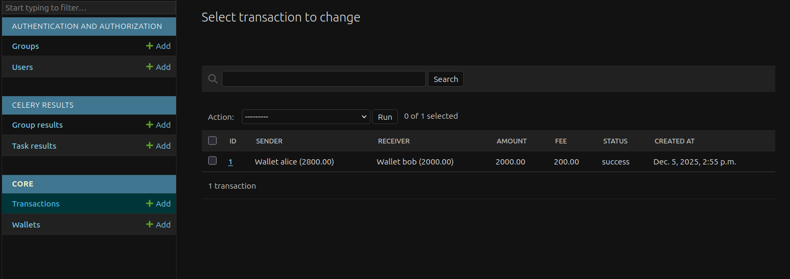
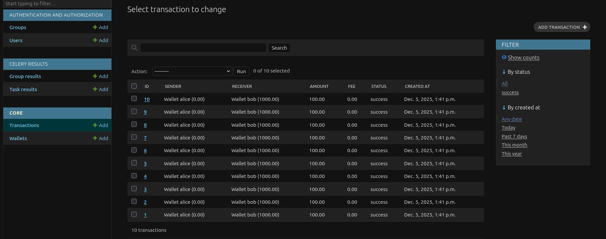
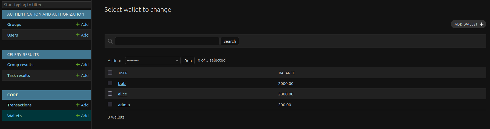
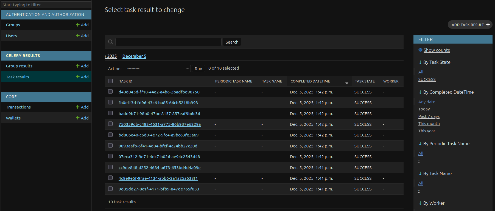

[](https://github.com/EdvardFarrow/transactional-wallet-service/actions/workflows/ci.yml)

[](README_ru.md)

# Сервис транзакций

Микросервис для обработки внутренних транзакций и начисления бонусов.

Реализует отказоустойчивое процессорное ядро ​​с защитой от **Race Conditions** (двойных трат) и асинхронных уведомлений.

---

## Ключевые особенности

### Надёжность и согласованность
* **Защита от Race Conditions:** Реализовано с помощью пессимистической блокировки (`select_for_update`).
* **Защита от взаимоблокировок:** Блокировка ресурсов всегда происходит в строго определённом порядке (сортировка по `wallet_id`).
* **Атомарность:** Списание, зачисление и начисление комиссий происходят в рамках одной транзакции. Либо всё успешно, либо ничего.
* **Celery и безопасность данных:** Использование `transaction.on_commit` гарантирует отправку задач уведомлений брокеру только после фиксации данных в базе данных.

## Функциональность
* **API транзакций:** Переводы между пользователями с проверкой баланса.
* **Комиссия:** Автоматическое списание 10% со счёта `admin`, если сумма перевода превышает 1000.
* **Уведомления:** Асинхронная отправка статуса через Celery с механизмом **Retry** (при сетевых сбоях).

---

## Технический стек

* **Ядро:** Python 3.12 + Django 5 + DRF
* **База данных:** PostgreSQL 15 (требуется для поддержки `select_for_update` и высокой степени параллелизма).
* **Асинхронность:** Celery + Redis.
* **Инфраструктура:** Docker и Docker Compose.

---

## Быстрый старт

Проект включает `Makefile` для управления одной командой.

### 1. Запуск проекта
Создание контейнеров, применение миграций и создание тестовых данных (Алиса, Боб, Администратор):

```bash
1. `cp .env.example .env`
2. `make init` (ДБ и Пользователи)
3. 'make migrate' (Миграции)
4. `make run` (Запуск Сервера)
```
*Эти команды запускают web, db, redis, celery, применяют миграции и заполняют базу данных начальными данными.*


## Демонстрация (скрипт проверки)

Я написал специальный скрипт для демонстрации работы системы и проверки на наличие Race conditions. Вам не нужно вручную использовать Postman или curl.

Запустите интерактивную демонстрацию:
```bash
make result
```
*(Или вручную: docker compose exec web python result_example.py)*

Выберите в меню:

* Single Transfer: проверка стандартной транзакции и начисления комиссии.

* Race Condition Attack: запустить 30 одновременных потоков, пытающихся списать баланс в отрицательную сторону.

Ожидаемый результат: баланс не становится отрицательным, транзакции обрабатываются последовательно.

## Структура проекта

```plaintext
.
├── config/            # Настройки Django
├── core/              # Основное приложение
| ├── admin.py         # Панель администратора
│ ├── models.py        # Кошелек, модели транзакций
│ ├── views.py         # Логика транзакций и блокировки
│ ├── tasks.py         # Задачи Celery
│ └── tests.py         # Модульные тесты
├── result_example.py  # Демонстрационный скрипт состояния гонки
├── setup_data.py      # Скрипт инициализации данных
├── docker-compose.yml # Инфраструктура
└── Makefile           # Утилиты запуска
```

### Тесты

Запуск модульных тестов (проверка API, комиссий и ограничений):
```bash
make test
```

## Скриншоты

### Транзакция + комиссия


### Транзакции


### Кошельки + комиссия


### Celery_tasks

